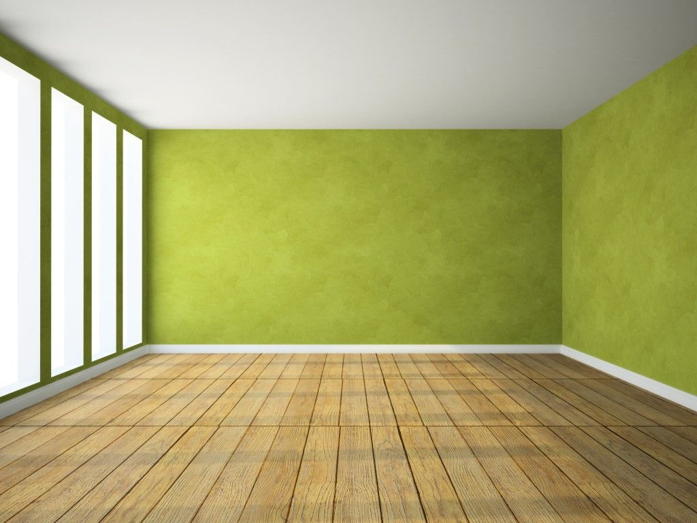
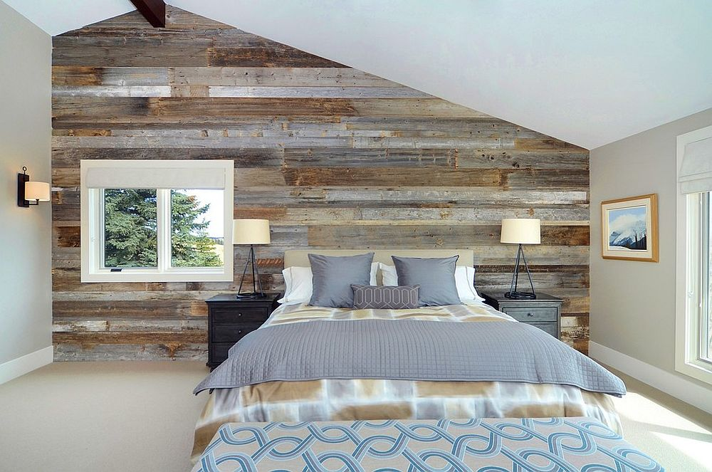
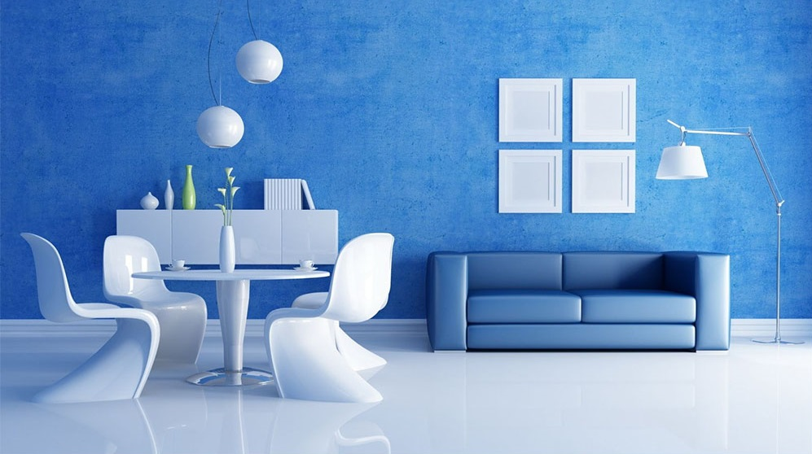
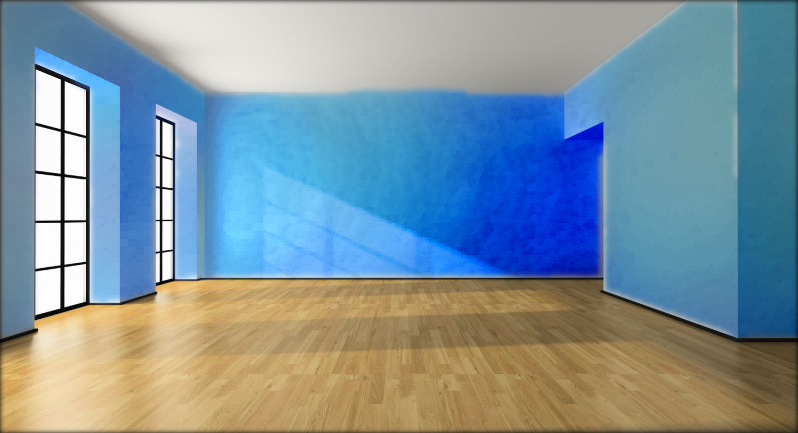
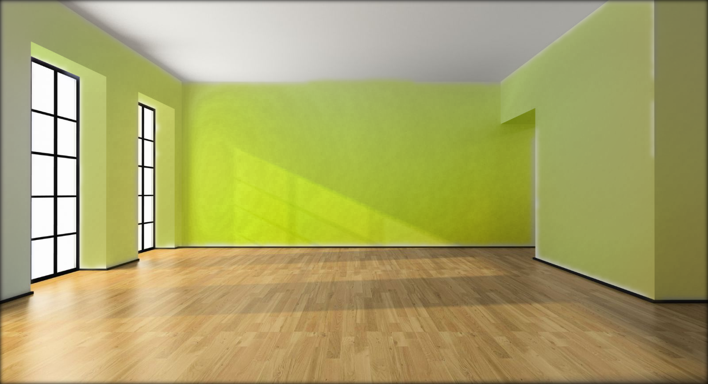
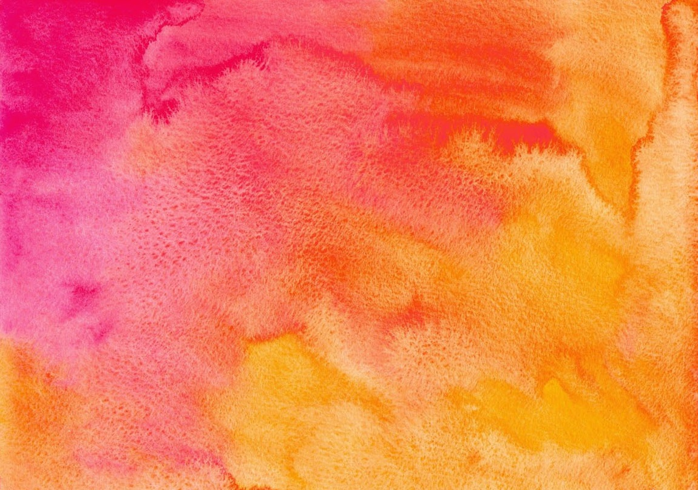
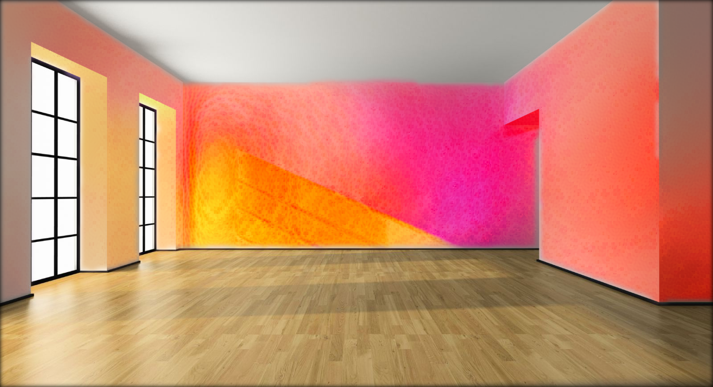
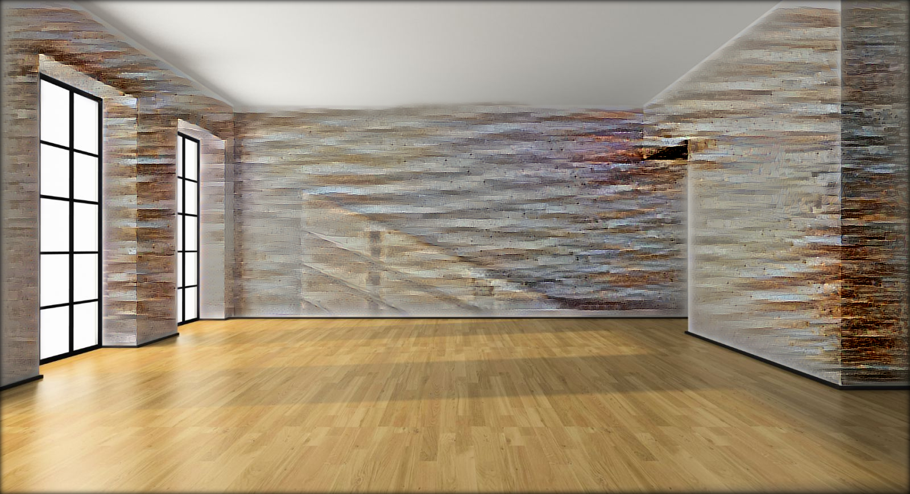
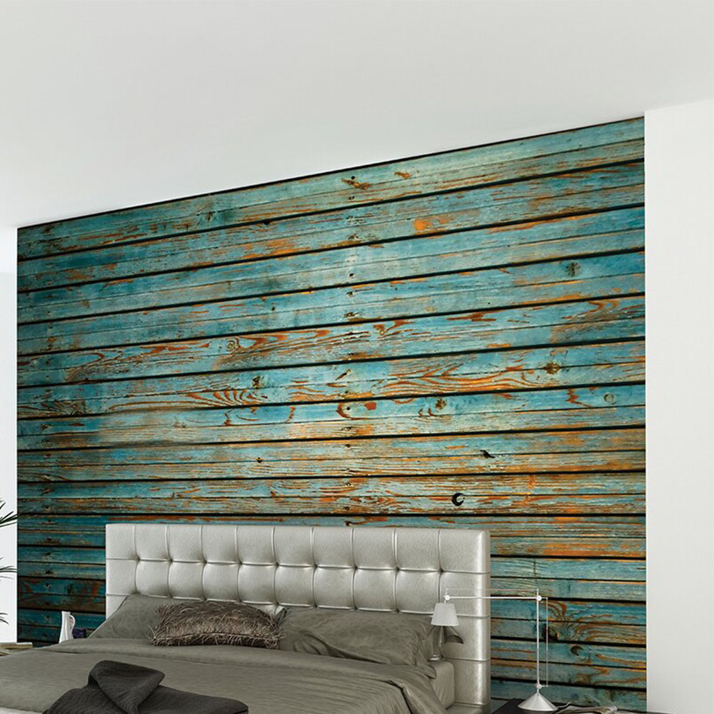
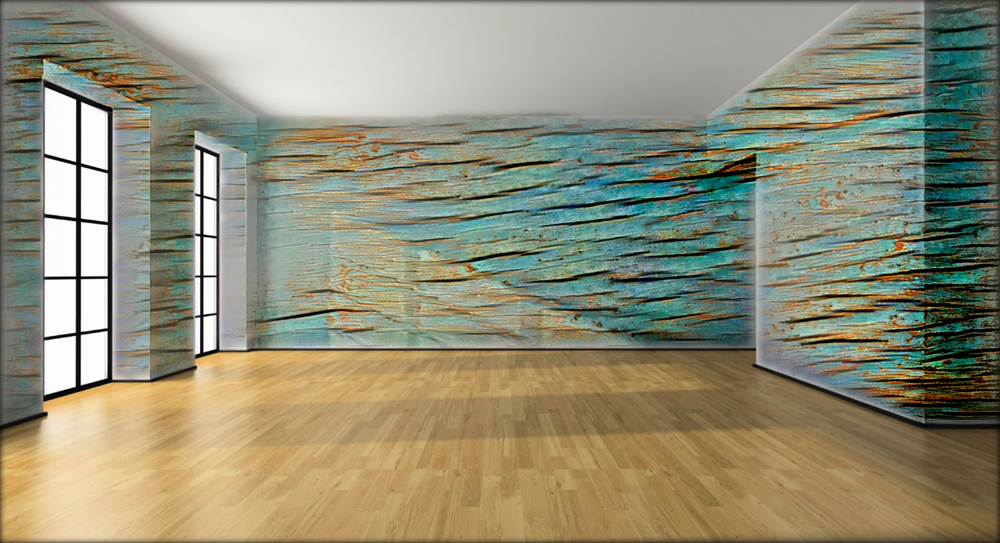

# An application of Deep Photo Style Transfer in Interior Design

This project aims to apply [Deep Photo Styletransfer](https://arxiv.org/abs/1703.07511) in developing an app that helps users apply the style from a sample image to the image of their house so that they can imagine how their house interior would look like after renovation. The source code is based on a [Tensorflow implementation](https://github.com/LouieYang/deep-photo-styletransfer-tf) of Deep Photo Styletransfer by Yang Liu.

The app will apply the style of the working area (marked by mask, read **Image Segmentation** for more info) in the style image to the working area in the input image.

<p align="center">
    
</p>

## Disclaimer
**This software is published for academic and non-commercial use only.**

## Setup
### Dependencies
* [Tensorflow](https://www.tensorflow.org/)
* [Numpy](www.numpy.org/)
* [Pillow](https://pypi.python.org/pypi/Pillow/)
* [Scipy](https://www.scipy.org/)
* [PyCUDA](https://pypi.python.org/pypi/pycuda) (used in smooth local affine)

***It is recommended to run the code on Google Colab, since you only need to install PyCUDA manually to setup. Check the provided Jupyter Notebook for a demo.***

### Download the VGG-19 model weights
The VGG-19 model of tensorflow is adopted from [VGG Tensorflow](https://github.com/machrisaa/tensorflow-vgg) with few modifications on the class interface. The VGG-19 model weights is stored as .npy file and could be download from [Google Drive](https://drive.google.com/file/d/0BxvKyd83BJjYY01PYi1XQjB5R0E/view?usp=sharing) or [BaiduYun Pan](https://pan.baidu.com/s/1o9weflK). After downloading, copy the weight file to the **./vgg19** directory

## Usage
### Basic Usage
You need to specify the path of content image, style image, content image segmentation, style image segmentation and then run the command

```
python deep_photostyle.py --content_image_path <path_to_content_image> --style_image_path <path_to_style_image> --content_seg_path <path_to_content_segmentation> --style_seg_path <path_to_style_segmentation> --style_option 0
```

*Example:*
```
python deep_photostyle.py --content_image_path ./examples/input/input.jpg --style_image_path ./examples/style/case6.jpg --content_seg_path ./examples/segmentation/input_mask.jpg --style_seg_path ./examples/segmentation/case6_mask.jpg --style_option 0 --max_iter 2000 --apply_smooth False --init_image_path ./examples/input/input.jpg --style_weight 1e3
```

There are three use cases for this application: transfering a plain color, a pattern (with edges) and a blend of plain color and small-size pattern. Each of them requires a different set of options. The following images demonstrates the idea.

<p align="center">
    
    
    
</p>

* Plain color: affine loss on, local affine smoothing on. Example:
```
python deep_photostyle.py --content_image_path ./examples/input/input.jpg --style_image_path ./examples/style/case1.jpg --content_seg_path ./examples/segmentation/input_mask.jpg --style_seg_path ./examples/segmentation/case1_mask.jpg --style_option 2 --max_iter 1000 --apply_smooth True --init_image_path ./examples/input/input.jpg
```
* Pattern: affine loss off to transfer edges, local affine smoothing off to keep those edges. Example:
```
python deep_photostyle.py --content_image_path ./examples/input/input.jpg --style_image_path ./examples/style/case5.jpg --content_seg_path ./examples/segmentation/input_mask.jpg --style_seg_path ./examples/segmentation/case5_mask.jpg --style_option 0 --max_iter 2000 --apply_smooth False --init_image_path ./examples/input/input.jpg --style_weight 1e3
```
* Plain color + small-size pattern: affine loss can be turned on or off depends on what we want in the result, local affine smoothing off to keep the pattern. Example:
```
python deep_photostyle.py --content_image_path ./examples/input/input.jpg --style_image_path ./examples/style/case2.jpg --content_seg_path ./examples/segmentation/input_mask.jpg --style_seg_path ./examples/segmentation/case2_mask.jpg --style_option 0 --max_iter 2000 --apply_smooth False --init_image_path ./examples/input/input.jpg
```

Because of the spillover effect on the non-working area of the output image, `replace_nonworking_area.py` is used (see the Jupyter Notebook for reference) to replace the non-working area of the output image with the non-working area of the input image.

### Other Options

`--style_option` specifies three different ways of style transferring. `--style_option 0` is to generate image without the photorealism regularization loss term (affine loss). `--style_option 1` generates image with the affine loss on. `--style_option 2` combines these two steps as a one line command to generate the final result directly. Note that the result of step 1 will be used as the initial image for step 2.

`--content_weight` specifies the weight of the content loss (default=5), `--style_weight` specifies the weight of the style loss (default=100), `--tv_weight` specifies the weight of variational loss (default=1e-3) and `--affine_weight` specifies the weight of affine loss (default=1e4). You can change the values of these weight and play with them to create different photos.

`--max_iter` specifies the maximum number of iterations to run in the training process (default=1000).

`--apply_smooth` specifies whether to apply local affine smoothing to the final result (default=True).

Run `python deep_photostyle.py --help` to see a list of all options

### Image Segmentation
The idea of image segmentation in this project is a bit different compared to that in the original source code. This app aims to transfer the style of only 1 area in the style image to only 1 area in the input image. These areas are called working areas and marked white in the masks. The rest of the style image and input image is non-working area and marked black in the masks. We aim to keep the style of non-working area in the input image unchanged.

Masks can be created manually using tools such as Photoshop or [PIXLR](https://pixlr.com/e/).

In this project, we also tested the idea of automatic segmentation using a pre-trained model. The source code of that model is provided.


## Examples
Here are more results (from left to right are input, style, and result). Different cases were tried in the following order:
* Transfering plain color
* Transfering color with small-size patterns
* Transfering color with bigger-size patterns
* Transfering color with even-bigger-size patterns
* Transfering a mixture of everything

<p align="center">
    
    
    
</p>

<p align="center">
    
    
    
</p>

<p align="center">
    
    
    
</p>

<p align="center">
    
    
    
</p>

<p align="center">
    
    
    
</p>

<p align="center">
    
    
    
</p>

## Acknowledgement

* This work was done by Vien Bui, Jacob John Jeevan and Viren Viraj Shankar at *the University of Alabama at Birmingam*.

* This repository is basically based on the [Tensorflow implementation](https://github.com/LouieYang/deep-photo-styletransfer-tf) of Deep Photo Styletransfer by Yang Liu.

## Contact
Feel free to contact me if there is any question (Vien Bui bnvien@gmail.com).
